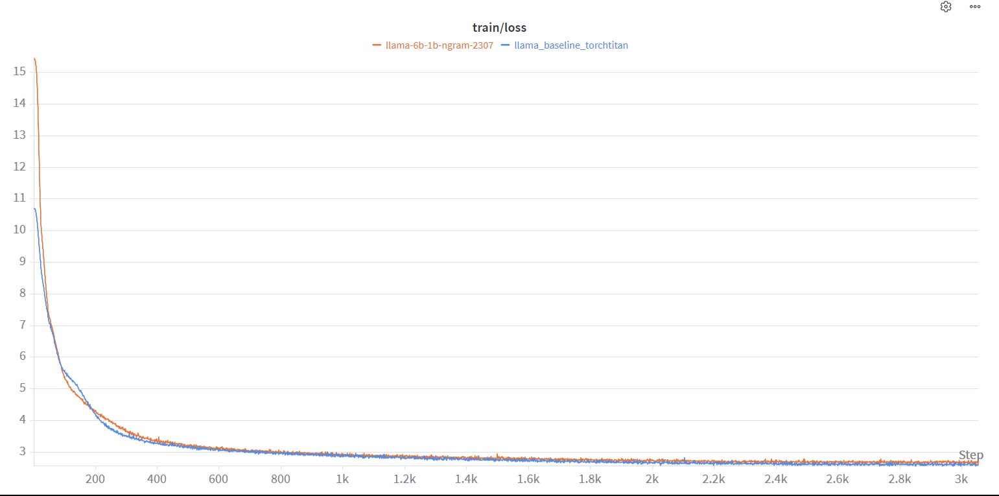

# Scaling NGram embeddings down to 1B

Lead: Rishikesh Mallagundla
Status: Done

# Hypothesis - what is this run for?

Existing works from longcat have proven that for large models (ranging from 20B-60B parameters) can benefit from sharing a large portion of their budget to ngram embeddings to save compute but also improve performance. This run documents our attempt at recreating these results in a 1B parameter scale.

# Setup Summary - what was done?

<aside>
💡

The architecture is the same Llama3 (GQA/RMSNorm/QKNorm) dense model with a Llama2 tokenizer (vocab size 32,000). We adopted the NGram embedding tables approach from longcat’s paper with ngram=4 and 2 tables with distinct vocabularies. The hyperparameters were adjusted to give near 52% parameters to the dense model and 48% to the ngram tables

</aside>

| Hyperparameter | Value |
| --- | --- |
| **Architecture** | Llama3 |
| Hidden Size | 1,536 |
| Intermediate Size | 5120 |
| Num Hidden Layers | 16 (prev experiments used 32)  |
| Num Attention Heads | 12 |
| Num KV Heads (GQA) | 6 |
| Max Position Embeddings | 8,192 |
| Vocab Size | 32,000 (Llama2 tokenizer) |
| Hidden Activation | SiLU |
| Attention Bias | False |
| Attention Implementation | Flash Attention 4 (without GQA packing, it was breaking for the GPUs) |
| Initializer Range | 0.02 |
| **Training** |  |
| Max Steps | 3,053 |
| Max Sequence Length | 8,192 |
| Per-Device Batch Size | 12 |
| Gradient Accumulation Steps | 20 |
| Gradient Clip | 1.0 |
| **Optimizer (Muon)** |  |
| Muon LR | 0.02 |
| Muon Momentum | 0.95 |
| Muon NS Steps | 5 |
| Muon Nesterov | True |
| Muon Weight Decay | 0.1 |
| **Auxiliary Optimizer (AdamW)** |  |
| Aux Adam LR | 3e-4 |
| Aux Adam β₁ | 0.9 |
| Aux Adam β₂ | 0.95 |
| Aux Adam ε | 1e-8 |
| Aux Adam Weight Decay | 0.1 |
| **LR Schedule** |  |
| LR Decay Type | Cosine |
| Warmup Steps | 150 |
| Min LR Factor | 0.1 |
| **Data** |  |
| Dataset | FineWeb (`sample-10BT`) - Only used 6B tokens |
| Dataloader Workers | 8 |
| Dataloader Prefetch Factor | 2 |
| **Embedding tables** |  |
| n-gram | 4 |
| Number of tables | 2 |
| vocabulary sizes  | [267003, 367007, 305011, 341013, 345017, 308962] |

The training script uses the same set of optimizations: flash attention 4 (tuned specifically for blackwell), liger kernels for swiglu, rms norm and torchtitan to train on an NVIDIA B200 and ran for ~10.5 hours. The batch size and gradient accumulation were tweaked based on VRAM usage and to prevent out of memory crashes. The vocabulary sizes were established based on (1) recommendations from the paper itself (2) how much additional parameters it adds to the model, and making sure that we try to keep similarly sized models. 

The current config produces a ~1.03B param model, close to the 1.02B param model produced by prior runs. 

# Outcomes - what are the results?

## Training run plots

Training loss curves between ngram (orange) and baseline (blue). Their trajectories are very similar, but the ngram run has more stable trajectory from steps 200-500 than the baseline. 

Gradient norm plot. The addition of QKNorm has definitely proved to be beneficial for stability. Orange (ngram run) has converged and remained stable since step 800.

## Evaluations

| Step | Tokens | HellaSwag | WinoGrande | ARC-E | ARC-C | PIQA | OBQA | CSQA | SciQ | BoolQ | LAMBADA | Avg (shared 9) |
| --- | --- | --- | --- | --- | --- | --- | --- | --- | --- | --- | --- | --- |
| 500 | ~1B | 0.2773 | 0.4996 | 0.3291 | 0.2167 | 0.5827 | 0.2520 | 0.1974 | 0.5890 | — | 0.1972 | 0.3490 |
| 1000 | ~2B | 0.3059 | 0.5170 | 0.3628 | 0.2287 | 0.6219 | 0.2800 | 0.1982 | 0.5980 | — | 0.2655 | 0.3753 |
| 1500 | ~3B | 0.3265 | 0.5225 | 0.3758 | 0.2193 | 0.6360 | 0.2700 | 0.1974 | 0.6130 | — | 0.2763 | 0.3819 |
| 2000 | ~4B | 0.3430 | 0.4949 | 0.3809 | 0.2227 | 0.6594 | 0.2760 | 0.1982 | 0.6250 | — | 0.3138 | 0.3904 |
| 2500 | ~5B | 0.3497 | 0.4870 | 0.3838 | 0.2176 | 0.6561 | 0.2840 | 0.1998 | 0.6230 | — | 0.3284 | 0.3922 |
| 3000 | ~6B | 0.3537 | 0.4901 | 0.3830 | 0.2287 | 0.6469 | 0.2860 | 0.2007 | 0.6260 | — | 0.3330 | 0.3942 |
| 3053 | ~6B | 0.3522 | 0.4925 | 0.3847 | 0.2287 | 0.6507 | 0.2820 | 0.1990 | 0.6330 | — | 0.3357 | 0.3954 |
|  |  |  |  |  |  |  |  |  |  |  |  |  |

*Random baseline: 0.25 (HellaSwag, 4-way MCQ), 0.50 (Winogrande, binary)*

### Interpretation

Over the course of training (500 → 3053 steps, ~1B → ~6B tokens) the ngram model's 9-benchmark average rises from 0.3490 to 0.3954 (+13.3% relative). The gains are not uniform across benchmarks:

| Benchmark | Step 500 | Step 3053 | Abs Δ | Rel Δ |
| --- | --- | --- | --- | --- |
| LAMBADA | 0.1972 | 0.3357 | +0.1385 | +70.2% |
| HellaSwag | 0.2773 | 0.3522 | +0.0749 | +27.0% |
| ARC-E | 0.3291 | 0.3847 | +0.0556 | +16.9% |
| OBQA | 0.2520 | 0.2820 | +0.0300 | +11.9% |
| PIQA | 0.5827 | 0.6507 | +0.0680 | +11.7% |
| SciQ | 0.5890 | 0.6330 | +0.0440 | +7.5% |
| ARC-C | 0.2167 | 0.2287 | +0.0120 | +5.5% |
| WinoGrande | 0.4996 | 0.4925 | −0.0071 | −1.4% |
| CSQA | 0.1974 | 0.1990 | +0.0016 | +0.8% |

Key observations:

1. **LAMBADA improves the most by far** (+70% relative, +0.14 absolute). The n-gram embedding tables give the model a strong prior for next-word prediction — exactly what LAMBADA measures. This is the single strongest signal that the embedding approach is capturing useful surface-level statistics.
2. **CSQA is stuck near random** (~0.20 for a 5-way MCQ). The model has not learned enough commonsense reasoning to move this benchmark at all in 6B tokens. This is a capacity or data bottleneck, not an n-gram-specific issue.
3. **WinoGrande is flat.** It starts high (~0.50, near coin-flip for a binary task) and stays there. The model has not yet acquired enough coreference resolution capability to push past chance.
4. **Most benchmarks show diminishing returns after ~4B tokens.** HellaSwag, ARC-E, PIQA, and SciQ all plateau or dip between steps 2500–3000 before recovering slightly at 3053. The model is still learning but the rate has slowed — more data would help determine whether this is a soft shoulder or a ceiling.

## Comparison to the 1b baseline

| Step | Baseline | Ngram | Delta | Rel Δ |
| --- | --- | --- | --- | --- |
| 500 | 0.3354 | 0.3490 | +0.0136 | +4.1% |
| 1000 | 0.3577 | 0.3753 | +0.0176 | +4.9% |
| 1500 | 0.3764 | 0.3819 | +0.0055 | +1.5% |
| 2000 | 0.3990 | 0.3904 | −0.0086 | −2.2% |
| 2500 | 0.4047 | 0.3922 | −0.0125 | −3.1% |
| 3000 | 0.4049 | 0.3942 | −0.0107 | −2.6% |
| 3052/53 | 0.4061 | 0.3954 | −0.0107 | −2.6% |

.png)

The ngram model **leads** through ~1500 steps (~3B tokens), then the baseline pulls ahead and stabilises at a 2.6% relative gap — roughly half the ~6% gap that comparing the raw table headers would suggest.

### Per-benchmark breakdown (final step)

| Benchmark | Baseline | Ngram | Δ | Rel Δ |
| --- | --- | --- | --- | --- |
| LAMBADA | 0.2666 | 0.3357 | +0.0691 | **+25.9%** |
| CSQA | 0.1982 | 0.1990 | +0.0008 | +0.4% |
| WinoGrande | 0.5043 | 0.4925 | −0.0118 | −2.3% |
| ARC-E | 0.3994 | 0.3847 | −0.0147 | −3.7% |
| PIQA | 0.6801 | 0.6507 | −0.0294 | −4.3% |
| SciQ | 0.6630 | 0.6330 | −0.0300 | −4.5% |
| OBQA | 0.3040 | 0.2820 | −0.0220 | −7.2% |
| ARC-C | 0.2491 | 0.2287 | −0.0204 | −8.2% |
| HellaSwag | 0.3901 | 0.3522 | −0.0379 | −9.7% |

### Interpretation

1. **Ngram learns faster early.** Through 3B tokens the ngram model leads on average, suggesting the n-gram embedding tables provide useful inductive bias that lets the model bootstrap quickly. The baseline overtakes only after ~4B tokens, when deeper transformer capacity begins to compound.
2. **LAMBADA is a clear win for ngram (+25.9%).** LAMBADA tests next-word prediction from broad context — exactly the regime where surface-level n-gram statistics are most informative. This is the strongest evidence that the embedding tables capture signal the vanilla embedding layer misses entirely.
3. **Reasoning-heavy benchmarks take the largest hit.** HellaSwag (−9.7%) and ARC-C (−8.2%) require multi-step compositional reasoning that depends on transformer depth. Knowledge-recall and pattern-matching benchmarks (CSQA, WinoGrande, ARC-E) are nearly unaffected.
4. **Neither model has plateaued at 6B tokens.** Both are still improving at step 3000+, and the baseline's gains are flattening (3000 → 3052 adds only +0.0012 to its 9-bench avg) while the ngram model keeps a similar pace. More tokens could narrow the gap further.

# Next steps

1. We can try different variants of the ngram table sizes - anywhere from 30% of the total parameters to 90% of total parameters. 
2. We can sub out the dense backbone for an MoE to get further compute gains during inference. 

# Run URL

[storm-dpo](https://wandb.ai/storm-dpo/llama-1b-6b-torchtitan/runs/0ps3r5gr)

# References

[1] Scaling Embeddings Outperforms Scaling Experts in Language Models

[arxiv.org](https://arxiv.org/pdf/2601.21204v1)