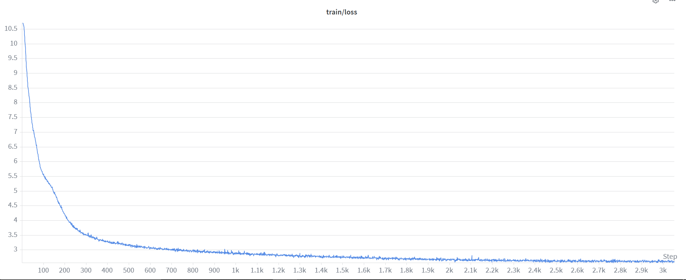

# 1B - Baseline run with 6B tokens

Lead: Rishikesh Mallagundla
Status: Done

# Hypothesis - what is this run for?

The baseline training run for a 1B dense model using 4B tokens from fineweb should converge without any spikes in loss or gradient norm. 

# Setup Summary - what was done?

<aside>
👉

**TLDR:** The backbone is the same dense Llama3 architcture using grouped query attention that was trained on ~6B tokens with 8192 token chunks for 3053 steps (1 epoch). We used the Llama2 tokenizer with 32k vocab size to keep it english only. The pretrained model was later evaluated using the winogrande and hellaswag benchmarks. 

</aside>

| Hyperparameter | Value |
| --- | --- |
| **Architecture** | Llama3 |
| Hidden Size | 1,536 |
| Intermediate Size | 5120 |
| Num Hidden Layers | 32 |
| Num Attention Heads | 12 |
| Num KV Heads (GQA) | 6 |
| Max Position Embeddings | 8,192 |
| Vocab Size | 32,000 (Llama2 tokenizer) |
| Hidden Activation | SiLU |
| Attention Bias | False |
| Attention Implementation | Flash Attention 4 (without GQA packing, it was breaking for the GPUs) |
| Initializer Range | 0.02 |
| **Training** |  |
| Max Steps | 3,053 |
| Max Sequence Length | 8,192 |
| Per-Device Batch Size | 12 |
| Gradient Accumulation Steps | 20 |
| Gradient Clip | 1.0 |
| **Optimizer (Muon)** |  |
| Muon LR | 0.02 |
| Muon Momentum | 0.95 |
| Muon NS Steps | 5 |
| Muon Nesterov | True |
| Muon Weight Decay | 0.1 |
| **Auxiliary Optimizer (AdamW)** |  |
| Aux Adam LR | 3e-4 |
| Aux Adam β₁ | 0.9 |
| Aux Adam β₂ | 0.95 |
| Aux Adam ε | 1e-8 |
| Aux Adam Weight Decay | 0.1 |
| **LR Schedule** |  |
| LR Decay Type | Cosine |
| Warmup Steps | 100 |
| Min LR Factor | 0.1 |
| **Data** |  |
| Dataset | FineWeb (`sample-10BT`) - Only used 6B tokens |
| Dataloader Workers | 8 |
| Dataloader Prefetch Factor | 2 |

The training script uses the same set of optimizations: flash attention 4 (tuned specifically for blackwell), liger kernels for swiglu, rms norm and torchtitan to train on an NVIDIA B200 and ran for ~14.5 hours. The batch size and gradient accumulation were tweaked based on VRAM usage and to prevent out of memory crashes. 

# Outcomes - what are the results?

The loss converged at ~2.62 and gradient norm stabilized after ~2420 steps steps. One concerning aspect was gradient norms wavy behvior but. According to chinchilla’s calculations the ideal loss should be around 2.79, the final loss being in that range confirms that the run went well, but future runs should tweak the config to get more stable gradient updates. 

## Plots

## Evaluations

| Step | Tokens | HellaSwag | Winogrande | ARC-E | ARC-C | PIQA | OBQA | CSQA | SciQ |  | LAMBADA | Avg |
| --- | --- | --- | --- | --- | --- | --- | --- | --- | --- | --- | --- | --- |
| 500 | ~1B | 0.2793 | 0.5162 | 0.3169 | 0.2108 | 0.5892 | 0.2520 | 0.1949 | 0.5330 |  | 0.1261 | **0.3543** |
| 1000 | ~2B | 0.3194 | 0.4980 | 0.3519 | 0.2227 | 0.6094 | 0.2780 | 0.1982 | 0.5730 |  | 0.1683 | **0.3808** |
| 1500 | ~3B | 0.3446 | 0.5091 | 0.3691 | 0.2287 | 0.6425 | 0.2800 | 0.1982 | 0.6020 |  | 0.2133 | **0.3979** |
| 2000 | ~4B | 0.3721 | 0.5193 | 0.3956 | 0.2398 | 0.6616 | 0.3100 | 0.1982 | 0.6400 |  | 0.2544 | **0.4163** |
| 2500 | ~5B | 0.3845 | 0.5209 | 0.3977 | 0.2483 | 0.6806 | 0.2960 | 0.2007 | 0.6530 |  | 0.2606 | **0.4207** |
| 3000 | ~6B | 0.3885 | 0.5075 | 0.3969 | 0.2457 | 0.6795 | 0.3020 | 0.1982 | 0.6600 |  | 0.2659 | **0.4198** |
| 3052 | ~6B | 0.3901 | 0.5043 | 0.3994 | 0.2491 | 0.6801 | 0.3040 | 0.1982 | 0.6630 |  | 0.2666 | **0.4215** |

*Random baseline: 0.25 (HellaSwag, 4-way MCQ), 0.50 (Winogrande, binary)*

---

## Interpretation

- **HellaSwag** (0.28 → 0.39): The most reliable signal of general language modeling quality. Steady, monotonic improvement throughout, and still not flat at 6B tokens — more headroom remains.
- **LAMBADA** (0.13 → 0.27): The biggest relative gain in the suite (+105% over 6B tokens). LAMBADA tests long-range coherence and word prediction at the end of a passage — the rapid improvement here suggests the model is learning document-level context well. Still well below converged baselines (~0.60+ for fully trained 1B models), so this will keep climbing with more tokens.
- **PIQA** (0.59 → 0.68): Physical intuition / commonsense QA. Consistent gains, approaching the range of fully-trained small models (~0.71 for Pythia-1B).
- **SciQ** (0.53 → 0.66): Science MCQ. Strong improvement, likely reflecting FineWeb's coverage of web-scraped scientific text.
- **ARC-Easy** (0.32 → 0.40): Steady climb, still improving. Not yet at Pythia-1B territory (~0.57), expected given token count.

### Weak / stalled tasks

- **CSQA** (CommonsenseQA, 0.1949 → 0.1982): Essentially flat just below random (0.20 for 5-way MCQ). CSQA requires structured commonsense knowledge graphs that simply don't emerge at this scale/token count. Not a concern.
- **Winogrande** (0.52 → 0.50): Hovering at random chance as expected. Binary pronoun resolution needs far more scale.
- **ARC-Challenge** (0.21 → 0.25): Very slow improvement. ARC-C is hard reasoning — only just reaching random baseline by end of training, which is normal for an undertrained 1B model.
- **BoolQ** (0.52 → 0.56): Marginal gains, and notably **drops between steps 2500 and 3000** before recovering. BoolQ (yes/no reading comprehension) can be noisy for pretrained models without instruction tuning, so this variance is expected.

### Comparison to the 500M Model

| Model | Tokens | HellaSwag acc_norm | Winogrande acc |
| --- | --- | --- | --- |
| 500M | ~4B | 0.3386 | 0.5114 |
| 1B | ~4B (step 2000) | 0.3721 | 0.5193 |
| 1B | ~6B (final) | 0.3901 | 0.5043 |

The 1B model at the **same token count (4B)** already beats the fully-trained 500M by +3.4 points on HellaSwag, consistent with scaling law predictions — more parameters win even when undertrained. By 6B tokens the gap has widened to +5.1 points.

### Overall Assessment

The average across all 10 tasks rises from **0.354 → 0.422**, a clean +6.8 point gain over 6B tokens. Critically, the final two checkpoints (step 3000 → 3052) still show improvement in the average (0.4198 → 0.4215), confirming the model has not converged. The strong LAMBADA and PIQA trajectories in particular suggest continued training would yield meaningful returns. At Chinchilla-optimal (~20B tokens for a 1B model), you would expect the average to approach the 0.48–0.52 range based on published Pythia/OPT comparisons.

## Next experiments

We have solid baselines to compare in multiple model sizes. Next experiments can be done with PLEs or n-gram embeddings to test the hypothesis - whether we can train efficient models by adding more embeddings. 

# Run URL

[storm-dpo](https://wandb.ai/storm-dpo/llama-1b-6b-torchtitan/runs/7mxxf4wt)

# References